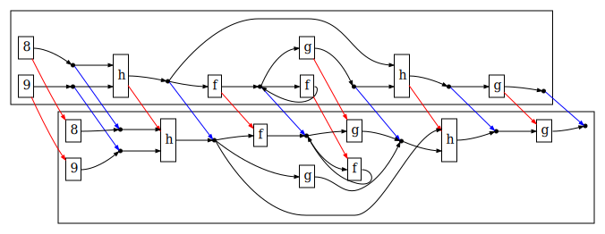

# CSetEGraphs.jl

Here we use [C-Sets](https://arxiv.org/abs/2106.04703) and [graph rewriting](https://arxiv.org/abs/2111.03784) to mimic the behavior of e-graphs. Because e-graphs only add or merge things, we never need rewrite rules which delete; therefore, our rewrite rules are simply morphisms which are applied via pushout.[^1] 

[^1]: No pushout complements needed, therefore the package [AlgebraicRewriting.jl](https://github.com/AlgebraicJulia/AlgebraicRewriting.jl) isn't needed.

**Warning**: what makes e-graphs an interesting data structure is its performance characteristics (e.g. of equality saturation and maintaining congruence). This library mimics the behavior of e-graphs without this performance. For example, C-Sets do not have a hashcons.

## E-graphs as C-Sets
The first step to using this library is to pick a *signature*. This is picking some symbols and assigning them input and output arities.

```julia 
# Signature: `f` a binary function, `g` a unary one 
fg = Dict(:f => (2=>1), :g => (1=>1))
FG = make_datatype(fg)
```

`FG` is the type of C-Sets with the following schema: 


There is a table `Class` which has one row for each e-class. There are no columns other than the identity (primary key).

There is a table `f` for e-terms whose outermost constructor is `f`. The output of this term lives in an e-class: this is given by `f¹`. Each such term also has two inputs, which are eclasses `f₁` and `f₂`. Likewise for `g`.

We can construct a term as a Julia expression:

```julia
fgg = :(f(g(x),g(x)))
db = from_expr(FG, fgg)
```


We can identify `f(g(x),g(x))` with `g(x)`

```julia
db2 = merge(db, fgg, :(g(x)), (x=1,))
```


Because our 'e-graphs' are just C-Sets, we also have a notion of morphism between them consisting in assignments of e-classes and e-terms that preserve the local structure. We can also visualize these, using blue to visualize the mapping of e-classes and red to visualize the mapping of e-terms. For example, the identity on the above e-graph looks like this:


## Rewrites

For any term constructor in our schema, we can come up with two rules, an 
**introduction** rule and a **congruence rule**. For example, for a binary 
term constructor `h`, we automatically obtain the following introduction rule:


And the following congruence rule:


Furthermore, we may have domain specific rewrite rules which we can specify 
via providing a morphism of e-graphs. For example, the rule `f(f(x)) => f(x)`:

```julia
ffx = from_expr(S, :(f(f(x))))
fx_ffx = merge(ffx, :(f(x)), :(f(f(x))), (x=1,))
rule₁ = homomorphism(ffx, fx_ffx; monic=[:f])
```


We can also define a rule `g(f(x)) => g(x)`:

```julia 
gfx = from_expr(S, :(g(f(x))))
gx_gfx = merge(add_expr(gfx, :(g(x)), (x=1,)), :(g(f(x))), :(g(x)), (x=1,))
rule₂ = homomorphism(gfx, gx_gfx)
```


And lastly a rule `h(x, g(x)) => x`

```julia 
hexpr = :(h(x,g(x)))
hxgx = from_expr(S′, hexpr)
hxgxx = merge(hxgx, hexpr, :x, (x=1,))
rule₃ = homomorphism(hxgx, hxgxx)
```


## Saturation

We can apply the above three types of rules repeatedly via the `saturate` method until there are no rules that can be applied. There are a few caveats here: 

1. If we allowed ourselves to indiscriminately apply the introduction rules, it would be often the case that this process does not terminate. By default, the introduction rules are not run.
2. We might introduce something with a rule which seems like a change to the e-graph state, but if we ran congruence it would then collapse the graph back to its original state. Therefore whenever we run a custom rewrite rule we run congruence to saturation and only consider that rule to be a change if net effect is a change.
3. There is some arbitrariness in how the order of the firing of rules is chosen.

`saturate` takes an input e-graph, some custom rewrite rules, and returns a sequence of e-graph morphisms (paired with integers saying which rule was fired). `saturate` works by searching for homomorphisms from the domains of the rules into the current e-graph. When a match is found, it applies the rule via computing a pushout. For example, when we run `saturate` on the following e-graph:


We obtain four morphisms. The first one comes from applying `g(f(x)) => g(x)`:


The second comes from `f(f(x)) => f(x)`:


The third comes from `g(f(x)) => g(x)` again:



The last comes from `h(x, g(x)) => x`:


Now we can no longer apply any more rules.

